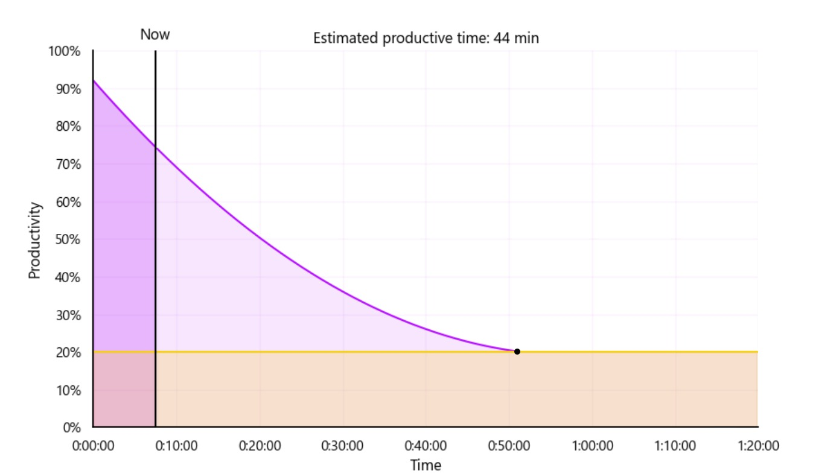

# ForeSight: Personalized Focus Prediction from EEG

## 🧠 Project Overview

**ForeSight** is a personalized attention-monitoring tool that uses EEG signals collected during a Stroop-like game to build an individual-specific model. Once trained, the model can estimate in real time how much focused attention time a person has left.

This product is fully **personalized**. During the calibration phase, each user plays a Stroop game  a well-established cognitive task used to induce varying levels of attention while their brain activity is recorded using a Muse EEG headband. These signals, paired with behavioral responses (reaction time and accuracy), are used to train a model tailored to the specific user.

Once a model is trained, the system can predict attention decay live, displaying a smooth, continuous estimation of how long the user is expected to stay focused.

---

## 📁 Project Structure

```
ForeSight/
├── app/
│   └── Productivity_monitor.py        # Real-time prediction GUI
│
├── data/
│   └── eeg_raw/                       # Bandpower features per session
│       ├── eeg_bandpower_session1.csv
│       ├── eeg_bandpower_session2.csv
│       └── eeg_bandpower_session3.csv
│
│   └── stroop_results/                # Stroop task results per session
│       ├── stroop_results_1.csv
│       ├── stroop_results_2.csv
│       └── stroop_results_3.csv
│
├── experiment/
│   └── stroop_eeg_pipeline.py         # Script that runs Stroop game + EEG recording
│
├── model/
│   ├── model_train.ipynb              # Model training and evaluation notebook
│   └── xgb_model.json                 # Exported trained model
```

---

##  Data Collection & Model Training

* EEG data was recorded using the **Muse 2016 headband**, streamed via **BlueMuse** and processed with `muselsl` and `pylsl`.
* Each user performed a Stroop-like task with clear timestamps, reaction time, and correctness for each trial.
* The data was merged with time-aligned EEG signals and engineered into meaningful features (e.g., alpha/beta ratios, frontal-parietal asymmetries).

* We trained several machine learning models to predict a normalized attention score, calculated from response time and accuracy. Among the models tested  including: Ridge Regression, Lasso Regression, and Linear Regression.
* the best result was achieved by **XGBoost (tuned), with an RMSE of 0.16.**


 Note: These results are from a limited set of EEG recordings collected during a short hackathon window. With more data and high-quality recordings, we expect performance to improve substantially.

---

## Real-Time Prediction

Once a model is trained, the system can continuously read EEG signals from the Muse headset and estimate **how much focused attention time remains**. This allows:

* Live monitoring of cognitive fatigue.
* Real-time biofeedback during tasks.

The smoothed prediction is updated dynamically, offering a window into the user’s current and future attentional state.

---
## ️ Example Output – Real-Time Focus Prediction
* Below is a real-time plot generated by the system, showing the estimated attention curve based on live EEG input. 
* The purple area represents the current productivity level, and the yellow threshold line marks the point at which focus is considered too low to be productive.
* Estimated productive time: 44 minutes



##  Future Directions

*  Collect more data across diverse individuals and conditions.
*  Fine-tune feature extraction and time-window strategies.
*  Expand real-time GUI feedback tools.
*  Deploy a lightweight app version.

---

##  Project Presentation

You can view our original hackathon pitch deck here:  
[📎Hackathon Presentation (PDF)](./docs/ForeSight_Pitch.pdf)

## Team

Developed during a neuroscience hackathon by:

* Dor Benita
* Moran Shavit
* Yoav Evron
* Oran Kedem
* Idan Schreiber
